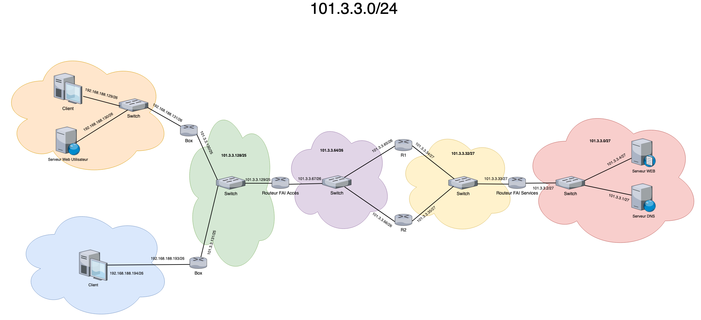

# Internet

L'objectif de ce projet était de créer deux réseaux privés avec des box internet et des utilisateurs et de créer un réseau public dans lequel il faut configurer un serveur DNS et un serveur web.

Sur l'image ci-dessous, figure le diagramme des différents réseaux dans leur configuration routage statique.

